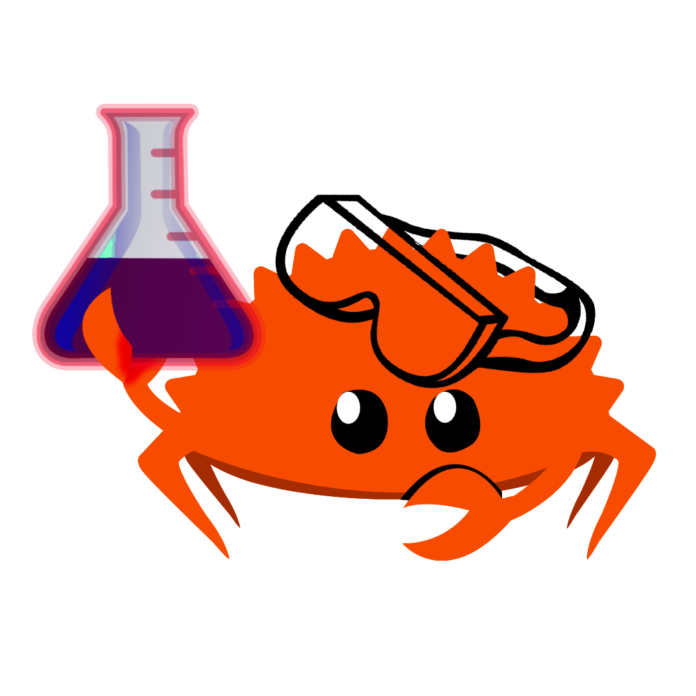

<div align="center">



# Rust Labs

**A playground of focused Rust experiments. Small, clear, practical.**  
*Made with love with Rust ❤️*

[](https://opensource.org/licenses/MIT)
[](https://www.rust-lang.org/)
[](CONTRIBUTING.md)

[**Explore Labs**](#-labs) • [**How to Run**](#-getting-started) • [**Contribute**](#-contributing)

</div>

---

## 📘 Philosophy: Why This Exists

Rust mastery comes from **mental models**, not just syntax.

**Rust Labs** is a collection of self-contained experiments, each exploring a single Rust concept in isolation. It is designed for developers—especially those migrating from languages like C++, Python, or JavaScript—who want to internalize *how* Rust works, rather than just blindly writing code that compiles.

The goal is simple: **Teach by doing.**
- ❌ No "fill in the missing semicolon" drills.
- ✅ Minimal, runnable programs that you can break, fix, and analyze.
- ✅ Deep explanations of "why" things crash or compile.

---

## 🚀 Getting Started

This repository is organized as a **Cargo Workspace**. You can run experiments from the root or navigate into specific labs.

### Prerequisites
- [Install Rust](https://www.rust-lang.org/tools/install) (latest stable).

### Workflow
1. **Clone the repo:**
   ```
   git clone https://github.com/AKRiLLiCK/rust-labs.git
   cd rust-labs
   ```

2. **Pick a lab and run it:**
   - *Option A (From Root):*
     ```
     cargo run -p ownership-moves
     ```
   - *Option B (Navigate):*
     ```
     cd labs/ownership-moves
     cargo run
     ```

3. **The most important step:**
   Open the source code (`src/main.rs`). Read the comments. Uncomment the "broken" lines to see the compiler errors yourself. **Break it, then fix it.**

---

## 🧪 Labs

Discover self-contained experiments, each exploring a single Rust concept.  
**Run any lab from root:** `cargo run -p <lab-name>`

| Concept               | Directory                         | Status      |
|-----------------------|-----------------------------------|-------------|
| **Ownership & Moves** | [`labs/ownership-moves/`](labs/ownership-moves/) | 🟡 WIP |
| **Borrowing & Refs**  | [`labs/borrowing/`](labs/borrowing/)             | 🔴 Planned |
| **Lifetimes**         | [`labs/lifetimes-basic/`](labs/lifetimes-basic/) | 🔴 Planned |
| **Pattern Matching**  | [`labs/patterns/`](labs/patterns/)               | 🔴 Planned |
| **Traits & Generics** | [`labs/traits-generics/`](labs/traits-generics/) | 🔴 Planned |
| **Error Handling**    | [`labs/errors/`](labs/errors/)                    | 🔴 Planned |
| **Iterators**         | [`labs/iterators/`](labs/iterators/)              | 🔴 Planned |
| **Concurrency**       | [`labs/concurrency/`](labs/concurrency/)          | 🔴 Planned |
| **Modules**           | [`labs/modules/`](labs/modules/)                  | 🔴 Planned |

**Legend:** 🟢 Ready • 🟡 WIP • 🔴 Planned  

**Add your own!** Follow [CONTRIBUTING.md](CONTRIBUTING.md) → `cargo new <lab-name> --bin` + `notes.md`

---

## 🤝 Contributing

This is an **Open Sandbox**. Contributions are welcome!

**See [CONTRIBUTING.md](CONTRIBUTING.md)** for detailed guidelines on:
- Adding simple labs (100-250 lines, single concept)
- Creating in-depth experiments with `notes.md`
- "Break-me" examples and mental model documentation

---

## 📄 License

MIT — Use, fork, learn, experiment.